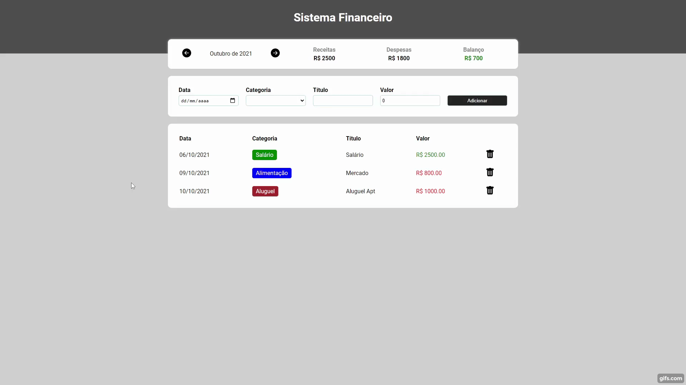

# Sistema Financeiro (Desafio B7Web 5 Em 5)
# Sobre o projeto

O projeto é o segundo do Desafio 5 em 5 React com Typescript proposto pela <a href="https://b7web.com.br/fullstack/">B7Web</a>. O site é um sistema de finanças pessoais, onde é possível adicionar gastos e receitas por data, categoria, título, valor e verificar o balanço mensal. Implementei também uma funcionalidade de remover lançamentos. 

## Demonstração 💻
 

## 🚀 Tecnologias Usadas

- ✔️ [React](https://pt-br.reactjs.org/)

- ✔️ [Styled-components](https://styled-components.com/docs/basics#installation)

- ✔️ [TypeScript](https://www.typescriptlang.org/)

